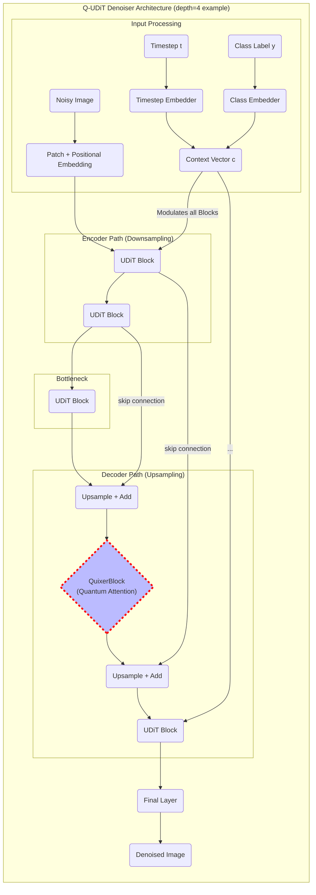

# Quasar: A Quantum-Attention-Powered Generative Model for Scientific Discovery

**Quasar** (QUantum Attention for Scientific ARt) is a research project investigating the potential of hybrid quantum-classical models to accelerate scientific discovery. This repository contains the official implementation of the **Q-UDiT**, a U-Net-style Diffusion Transformer that uses a quantum-native attention mechanism based on Quantinuum's **Quixer** architecture.

Our primary goal is to conduct a rigorous, empirical test of whether a hybrid quantum model can offer a practical advantage over state-of-the-art classical models for complex scientific image generation tasks, such as modeling galaxy morphologies and subcellular protein distributions.

## Architecture Overview

The Q-UDiT is a hybrid generative model based on a U-Net-style Diffusion Transformer. The classical UDiT provides a powerful, multi-scale backbone for image generation. Our key innovation is to replace one or more of the classical self-attention blocks with a `QuixerBlock`—a quantum-native attention mechanism that uses advanced quantum primitives (LCU and QSVT) to mix information between image patches. We hypothesize that this quantum mechanism can more efficiently learn the complex, stochastic correlations inherent in scientific data.



## Scientific Merit and Research Goals

This project is framed as a formal scientific experiment designed to answer the following core research questions:

1.  **Performance Superiority:** Can the quantum attention mechanism lead to a quantifiable improvement in generative performance (e.g., FID score, domain-specific metrics) over a purely classical model with a similar parameter count?
2.  **Data Efficiency:** Can the Q-UDiT learn a more effective representation from smaller datasets compared to its classical counterpart?
3.  **Structural Fidelity:** Does the Q-UDiT generate images that are more faithful to the underlying physical or biological structures of the data (e.g., matching the power spectrum of real galaxies)?

Our methodology involves rigorous, controlled comparisons between a classical UDiT baseline and our hybrid Q-UDiT, including ablation studies on the placement and resources of the quantum block.

## Repository Layout
```
quantum_transformers/
├── diffusion/          # Diffusion process wrapper (PyTorch Lightning)
├── quixer/             # The quantum QuixerBlock implementation
├── uditt/              # The classical UDiT backbone
├── datasets/           # Data loaders for scientific datasets
├── train_test.py       # End-to-end validation script
└── README.md
```

## Project Status & Milestones

1.  **Core Implementation & Validation** ✅
    -   **Classical UDiT Baseline**: Implemented and validated.
    -   **Quantum `QuixerBlock`**: LCU + QSVT implemented and validated.
    -   **Hybrid Integration**: End-to-end training of the Q-UDiT is functional.
    -   **Status**: Complete. The core codebase is stable and ready for experimentation.

2.  **Dataset Integration & Experimentation** ⏳
    -   Implement data loaders for Galaxy Zoo 2 and Human Protein Atlas.
    -   Run baseline and hybrid models.
    -   Perform ablation studies.
    -   **Status**: In Progress.

3.  **Analysis and Publication** 🔲
    -   Analyze results using standard and domain-specific metrics.
    -   Visualize model internals and generated outputs.
    -   Prepare results for publication.
    -   **Status**: Pending.

## Setup
```bash
# Clone the repository
git clone https://github.com/Quantum-Buddies/Quasar-QUantum-Attention-for-Scientific-ARt.git
cd Quasar-QUantum-Attention-for-Scientific-ARt

# Create a virtual environment and install dependencies
python -m venv venv
source venv/bin/activate
pip install -r requirements.txt
```
**Note**: This project requires a CUDA-enabled GPU with the NVIDIA cuQuantum SDK installed and a compatible version of PennyLane. See `requirements.txt` for details.

---
*Last Updated: 2025-06-26* 