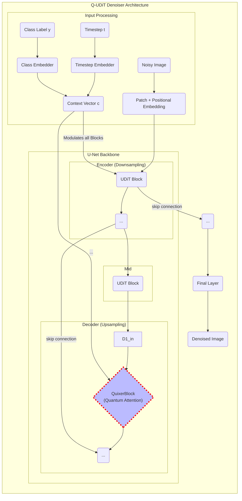

# Quantum Transformers Playground

This sub-package hosts our experimental implementation of a **Quixer-powered U-Net-style Diffusion Transformer (Q-UDiT)** aimed at scientific image generation tasks (galaxy morphologies from Galaxy Zoo 2, sub-cellular imagery from the Human Protein Atlas, etc.).

## Architecture Overview

We are building a hybrid quantum-classical generative model based on a U-Net-style Diffusion Transformer (UDiT). The classical UDiT architecture provides a powerful backbone for image generation, capable of capturing features at multiple scales.

Our key innovation is to replace one or more of the classical self-attention blocks with a `QuixerBlock`—a quantum-native attention mechanism developed by Quantinuum. The Quixer block uses advanced quantum primitives (LCU and QSVT) to mix information between image patches in a fundamentally new way, which we hypothesize will be exceptionally effective at generating the complex, stochastic textures found in scientific imagery.



## Repository layout

```
quantum_transformers/
├── diffusion          # Wrapper for training/ sampling loops
│   └── diffusion_model.py
├── quixer             # Quantum attention blocks (Quixer)
│   └── quixer_block.py
├── uditt              # Classical U-Net-style Diffusion Transformer backbone
│   └── uditt.py
├── __init__.py
└── README.md
```

## Project Status & Milestones

1.  **Classical UDiT baseline** ✅  
    – Implement hierarchical U-Net Transformer (without quantum parts) matching UDiTQC architecture.  
    – **Status**: Complete. The classical `UDiT` is implemented in `uditt/uditt.py`.

2.  **Quixer Block prototype** ⏳  
    – Port open-source Quixer implementation (LCU + QSVT) into `quixer/quixer_block.py`.  
    – Expose a PyTorch‐style `forward(patch_embeds) -> updated_embeds` interface using PennyLane's differentiable simulator (`lightning.gpu`).  
    – **Status**: In progress.

3.  **Hybrid Q-UDiT** 🔲  
    – Swap selected attention layers in the classical `UDiT` with the `QuixerBlock`.  
    – Benchmark FID vs. classical baseline on a target dataset (e.g., Galaxy Zoo).
    – **Status**: Pending.

## Setup

```bash
pip install -r requirements.txt
```

The `requirements.txt` will be generated once we stabilise dependencies, but expect: `torch`, `pytorch_lightning`, `timm`, `pennylane`, `pennylane-lightning[gpu]`, `einops`, etc.

---

*Last Updated: 2025-06-26* 